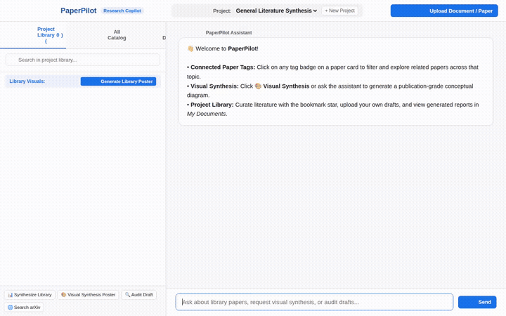

# 🧭 PaperPilot

> An agentic research assistant and scientific literature synthesis platform that manages project-specific paper libraries, searches arXiv, extracts structured findings, audits draft documents against published evidence, detects cross-literature corroborations and contradictions, generates academic visual posters, and renders publication-ready visual artifacts and A2UI cards.



Built with Google's **Agent Development Kit (ADK)**, **`agents-cli`**, and **Gemini 2.5 / 3.6 Flash**, deployed as an A2A-compliant agent on **Vertex AI Agent Platform**, with a containerized **FastAPI** web interface on **Cloud Run**.

---

## 🔬 What PaperPilot Does

PaperPilot acts as an autonomous pair-researcher for scientists and engineers navigating dense literature:

- **Academic Literature Discovery**: Connects directly to the live arXiv API to retrieve relevant preprints and peer-reviewed literature across AI, systems, and science topics.
- **Structured Paper Extraction**: Uses Gemini to digest abstracts and paper content into structured arguments, methodology details, core assumptions, and empirical findings.
- **Cross-Paper Consistency & Verification**: Analyzes pairs or sets of papers in Firestore to detect points of consensus, experimental divergences, and direct contradictions.
- **Draft & Report Grounding Audits**: Audits user-submitted draft manuscripts and project notes against the curated library corpus, flagging ungrounded claims and corroborating statements.
- **Literature Synthesis Consolidation**: Synthesizes multi-paper findings, notes, and contradiction matrices into structured comparative review dossiers.
- **Academic Visual Synthesis Posters**: Automatically designs publication-grade research posters for either the project library or manuscript drafts, visualizing themes, methodology matrices, and claim validation networks.
- **Gemini Omni Video Generation**: Uses Google's Omni model (`gemini-omni-flash-preview`) to generate concise scientific summary videos, storing them in the ADK Artifacts panel and streaming to Google Cloud Storage (sample included in [`presentation_video.mp4`](./presentation_video.mp4)).
- **Scientific Visual Generator**: Programmatically generates publication-style conceptual architecture diagrams and graphical abstracts, automatically hosting them on Google Cloud Storage.
- **Agent-First UI (A2UI)**: Returns native A2UI v0.8 cards using the Basic Catalog, rendering structured visual cards, metadata columns, and diagram previews.
- **Multi-Project Management**: Supports distinct project workspaces with separate library collections, user drafts, and isolated conversational contexts.

---

## ☁️ Google Cloud & Architectural Wiring

Based directly on the codebase (`app/`, `agents-cli-manifest.yaml`, and `frontend/main.py`), PaperPilot is wired to the following Google Cloud and ADK services:

| Component / Service | Implementation in Code | Role in PaperPilot |
|---|---|---|
| **Vertex AI Agent Runtime** | `agents-cli-manifest.yaml` (`is_a2a: true`, `deployment_target: agent_runtime`) | Hosts the ADK reasoning engine on Vertex AI over the Agent-to-Agent (A2A) protocol. |
| **Gemini Flash (`gemini-3.6-flash`)** | `app/agent.py` | Powers the central ReAct agent reasoning loop, extraction, and verification pipelines. |
| **Gemini Omni (`gemini-omni-flash-preview`)** | `app/video_generator.py` | Generates short research overview videos in the global region with in-memory streaming and ADK artifact integration. |
| **Google Cloud Firestore** | `app/firestore_tools.py`, `frontend/main.py` | Provides persistent NoSQL storage for: <br/>• `research_projects`: Project metadata and library memberships.<br/>• `research_resources`: Curated papers, arguments, findings, and tags.<br/>• `user_documents`: User-uploaded drafts and synthesized reports. |
| **Google Cloud Storage (GCS)** | `app/visual_generator.py`, `app/video_generator.py` | Publicly hosts generated scientific diagrams, posters, and video artifacts (`gs://paper-pilot-storage-...`). |
| **Cloud Run** | `frontend/Dockerfile`, `frontend/main.py` | Hosts the containerized FastAPI web frontend with IAM authentication to Agent Platform. |
| **A2UI (v0.8 Basic Catalog)** | `app/agent.py`, `app/a2ui_utils.py` | Generates declarative UI cards via `A2uiSchemaManager` and an `after_model_callback`. |
| **FastAPI A2A Proxy** | `frontend/main.py` | Serves the web interface and proxies user messages to the deployed reasoning engine via the A2A SDK. |

### 📋 Planned, Not Yet Implemented

To ensure transparency with the original `project_brief.md`, the following capabilities were planned but are not implemented in the current code:
- **Cross-session Vertex AI Memory Bank**: *Planned, not yet implemented.* The manifest specifies `session_type: "none"`. Conversation history is currently scoped per project via session context IDs in the FastAPI proxy rather than a managed Vertex AI Memory Bank.
- **Vertex AI RAG Engine Corpus**: *Planned, not yet implemented.* Literature retrieval is currently handled directly via the arXiv API tool and Firestore queries.
- **Code Execution Sandbox**: *Not implemented* (recomputation of paper metrics is not required).

---

## 🛠️ Implemented Agent Tools

The ADK agent in `app/agent.py` exposes the following 11 specialized tools:

1. `search_academic_literature(query, max_results)`: Searches arXiv for recent academic preprints.
2. `summarize_paper(paper_text, title)`: Extracts key arguments, methodology, findings, and conclusions.
3. `analyze_cross_paper_consistency(topic, paper_ids)`: Cross-references literature in Firestore to detect consensus and debates.
4. `audit_draft_report(draft_text, topic)`: Audits user drafts against the stored research library.
5. `consolidate_project_synthesis(topic, paper_ids)`: Compiles a structured synthesis report from library papers and notes.
6. `generate_visual_artifact(prompt, title, artifact_type)`: Renders scientific diagrams with Matplotlib and uploads them to GCS.
7. `generate_research_video(prompt, topic)`: Generates short research videos using Google's Omni model, saves them as ADK artifacts, and streams them to GCS.
8. `list_resources(topic)`: Lists catalogued research papers from Firestore.
9. `get_resource_details(resource_id)`: Fetches full details and extracted findings for a specific paper.
10. `save_resource(...)`: Saves or updates a paper with structured arguments and contradiction tags.
11. `add_local_paper(...)` / `add_project_note(...)`: Ingests user-supplied documents and notes into Firestore.

---

## 📂 Repository Structure

```
paper-pilot/
├── app/
│   ├── agent.py                  # Core ADK agent definition & A2UI system prompt
│   ├── a2ui_utils.py             # A2UI after-model callback & parser
│   ├── academic_search.py        # arXiv API search integration
│   ├── consistency_analyzer.py   # Cross-paper contradiction & agreement analysis
│   ├── firestore_tools.py        # Firestore CRUD operations for research resources
│   ├── local_resources.py        # Note and local document ingestion
│   ├── report_auditor.py         # Grounding & draft validation against literature
│   ├── summarizer.py             # Structured claim & methodology extraction
│   ├── synthesis_consolidator.py # Multi-paper comparative synthesis
│   ├── visual_generator.py       # Matplotlib diagram generator & GCS uploader
│   └── fast_api_app.py           # Local A2A server runner
├── frontend/
│   ├── main.py                   # FastAPI proxy server (Firestore + A2A client)
│   ├── requirements.txt          # Frontend dependencies
│   └── static/
│       └── index.html            # Research UI with project library & A2UI renderer
├── tests/                        # Agent unit and integration tests
├── pyproject.toml                # Agent dependencies and tooling configuration
└── agents-cli-manifest.yaml      # Agents CLI deployment manifest
```

---

## 🚀 Setup and Local Run Instructions

### Prerequisites

- Python 3.11+
- [uv](https://docs.astral.sh/uv/) package manager
- Google Cloud SDK (`gcloud`) authenticated to your GCP project

### 1. Install Dependencies

From the `paper-pilot` directory:

```bash
uv sync
```

### 2. Environment Configuration

Create a `.env` file in `paper-pilot/`:

```env
GOOGLE_GENAI_USE_VERTEXAI=true
GOOGLE_CLOUD_PROJECT=<your-gcp-project-id>
GOOGLE_CLOUD_LOCATION=global
```

Ensure application default credentials are set:

```bash
gcloud auth application-default login
```

### 3. Run the Agent Locally (ADK Playground)

To test the agent directly in the local ADK developer playground:

```bash
agents-cli playground
```

### 4. Run the Web Frontend Proxy

In a separate terminal, start the FastAPI web frontend:

```bash
cd frontend
pip install -r requirements.txt
export AGENT_ENGINE_RESOURCE_NAME="<your-deployed-reasoning-engine-resource-name>"
export AGENT_DIRECTORY="app"
python main.py
```

The frontend will start locally on your configured port (default: 8080).

### 5. Running Tests

Execute the automated test suite:

```bash
uv run pytest tests/
```
